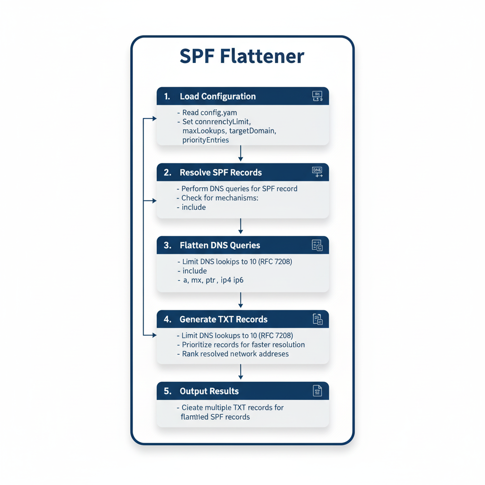

# SPF Flattener

SPF Flattener est un outil développé en Go conçu pour simplifier et optimiser les enregistrements SPF (Sender Policy Framework) de vos domaines.

Son rôle principal est de "mettre à plat" toutes les requêtes DNS générées par l'enregistrement SPF. Cette simplification est essentielle, car les normes techniques (RFC 7208.) limitent strictement à 10 le nombre de requêtes DNS autorisées pour valider un enregistrement SPF.

SPF Flattener vous aide ainsi à respecter cette limite et à garantir que votre SPF fonctionne correctement.



## Table des matières

- [Fonctionnalités](#fonctionnalités)
- [Installation](#installation)
- [Utilisation](#utilisation)
- [Configuration](#configuration)

## Fonctionnalités

- Résolution des enregistrements SPF en utilisant des requêtes DNS (spf-unflat.domain).
- Gestion des mécanismes SPF tels que `include`, `a`, `mx`, `ptr`, `ip4`, et `ip6`.
- Limitation des recherches DNS pour éviter les boucles infinies.
- Génération de plusieurs enregistrements TXT pour les enregistrements SPF complexes.
- **Priorisation des enregistrements** : Les enregistrements sont traités par ordre de priorité, permettant ainsi de résoudre les requêtes habituelles plus rapidement.
- **Classement des adresses réseau** : Les adresses réseau résolues sont classées pour garantir des résultats cohérents, même si les réponses DNS ne sont pas retournées dans le même ordre.

## Installation

Pour installer le projet, clonez le dépôt et exécutez les commandes suivantes :

```bash
git clone https://github.com/votre-utilisateur/spf-flattener.git
cd spf-flattener
go mod tidy
```

## Utilisation

Pour utiliser l'outil, exécutez la commande suivante :

```bash
go run main.go
```

Assurez-vous que le fichier de configuration `config.yaml` est présent dans le répertoire racine du projet.

## Configuration

Le fichier de configuration `config.yaml` doit contenir les paramètres suivants :

```yaml
concurrencyLimit: 10
maxLookups: 10
targetDomain: "domain.com"
priorityEntries:
  - "10.11.12.13/24"
  - "_spf.domain.com"
```

- `concurrencyLimit` : Limite le nombre de requêtes DNS simultanées.
- `maxLookups` : Limite le nombre total de recherches DNS autorisées.
- `targetDomain` : Le domaine cible pour lequel les enregistrements SPF doivent être résolus.
- `priorityEntries` : Une liste d'entrées prioritaires à inclure dans la résolution.
