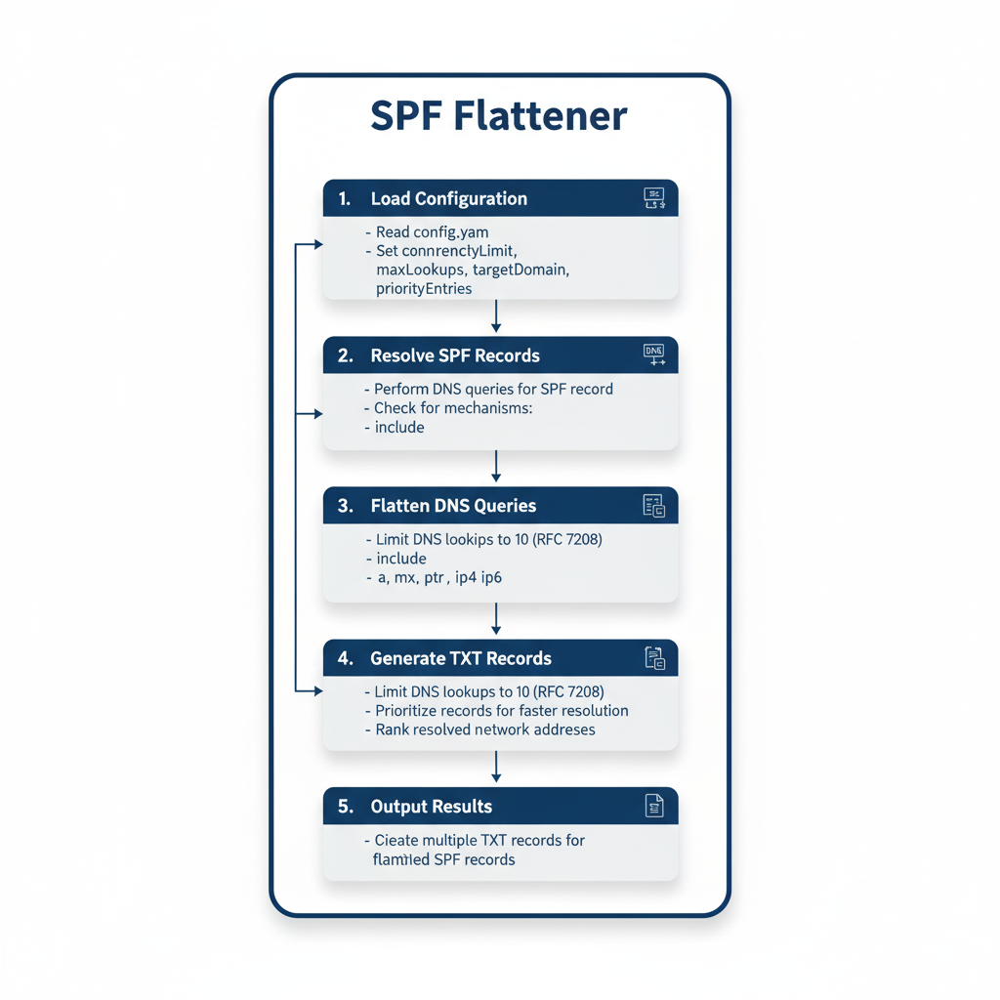

# SPF Flattener

SPF Flattener is a tool developed in Go designed to simplify and optimize SPF (Sender Policy Framework) records for your domains.

Its main role is to "flatten" all DNS queries generated by the SPF record. This simplification is essential because technical standards (RFC 7208) strictly limit the number of DNS queries allowed to validate an SPF record to 10.

SPF Flattener helps you comply with this limit and ensures that your SPF functions correctly.



## Table of Contents

- [Features](#features)
- [Installation](#installation)
- [Usage](#usage)
- [Configuration](#configuration)

## Features

- Resolution of SPF records using DNS queries (spf-unflat.domain).
- Management of SPF mechanisms such as `include`, `a`, `mx`, `ptr`, `ip4`, and `ip6`.
- Limitation of DNS lookups to avoid infinite loops.
- Generation of multiple TXT records for complex SPF records.
- **Prioritization of records**: Records are processed in order of priority, allowing for faster resolution of common queries.
- **Ranking of network addresses**: Resolved network addresses are ranked to ensure consistent results, even if DNS responses are not returned in the same order.

## Installation

To install the project, clone the repository and run the following commands:

```bash
git clone https://github.com/your-username/spf-flattener.git
cd spf-flattener
go mod tidy
```

## Usage

To use the tool, run the following command:

```bash
go run main.go
```

Make sure the configuration file `spf-flattener-config.yaml` is present in the root directory of the project.

## Configuration

The configuration file `spf-flattener-config.yaml` should contain the following parameters:

```yaml
concurrencyLimit: 10
maxLookups: 10
targetDomain: "domain.com"
priorityEntries:
  - "10.11.12.13/24"
  - "_spf.domain.com"
```

- `concurrencyLimit`: Limits the number of simultaneous DNS queries.
- `maxLookups`: Limits the total number of allowed DNS lookups.
- `targetDomain`: The target domain for which SPF records should be resolved.
- `priorityEntries`: A list of priority entries to include in the resolution.

Version v0.1 - thc2cat - 2025/20/21.
